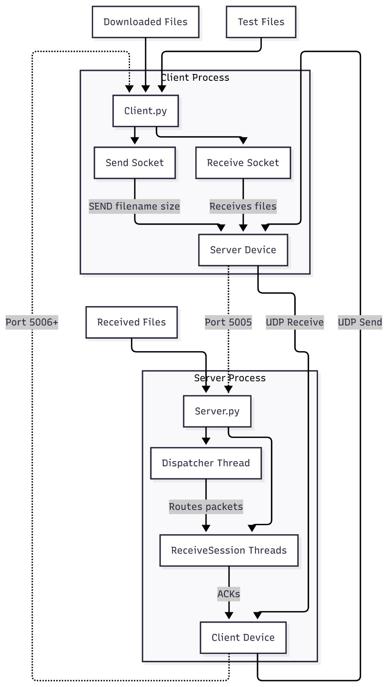
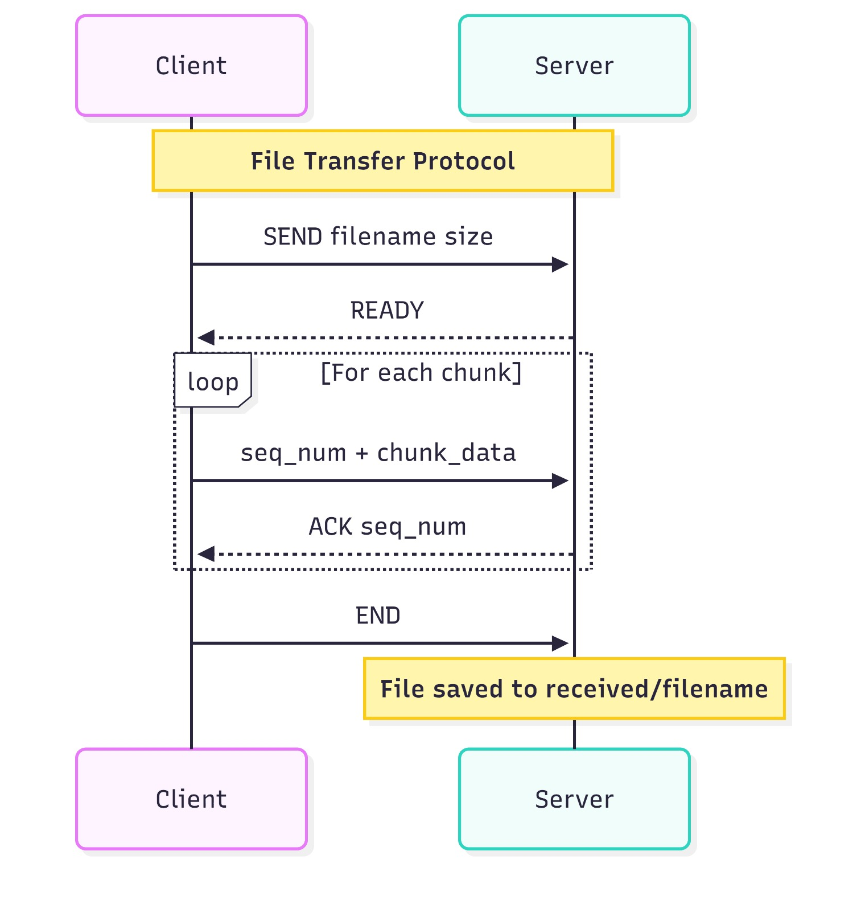
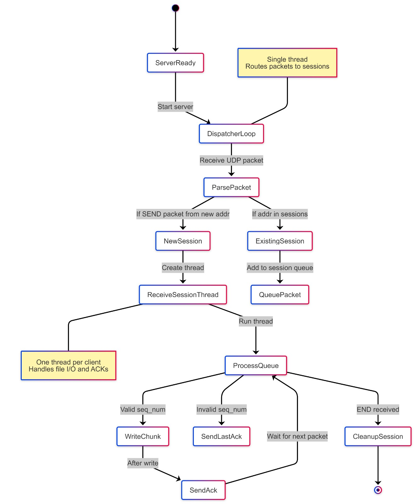

# UDP File Transfer System

This is a Python socket programming mini project implementing a reliable UDP-based file transfer system with concurrent client support. Clients can send and receive files over UDP with automatic retransmission and acknowledgment mechanisms.

> Made By:
>
> Akshansh Agrawal - PES2UG24CS045
> 
> Adarsh Shivanand Madli - PES2UG24CS028
> 
> ABHISHEK KUMAR SINGH - PES2UG24CS026


---

## Architecture



The system consists of a multi-threaded UDP server that can handle multiple concurrent file transfer sessions. Each client maintains separate send and receive sockets to avoid port conflicts.

---

## Main Features

- UDP-based reliable file transfer with sequence numbering and acknowledgments
- Multi-client concurrent support using threaded session management
- Automatic retransmission with bounded retry limits
- Safe file handling with path sanitization and organized folder structure
- Cross-platform compatibility (Windows/Linux)
- Performance evaluation tools
- Graceful error handling and timeout management

---

## Project Structure

```text
UDP-File-Transfer/
├── Server.py                 # Multi-threaded UDP server
├── Client.py                 # UDP client with dual sockets
├── perf_eval.py             # Performance evaluation script
├── README.md                # This documentation
├── Rubrics.pdf              # Project requirements
├── images/                  # Architecture diagrams
│   ├── architecture.png
│   ├── protocol_flow.png
│   └── concurrency.png
├── received/                # Server-side received files
├── downloads/               # Client-side downloaded files
├── mermaid/                 # Mermaid diagram sources (ignored)
│   ├── architecture.png.txt
│   ├── protocol_flow.png.txt
│   └── concurrency.png.txt
├── .gitignore
└── .git/
```

---

## Installation

### Prerequisites

- **Python 3.8+** (uses standard library only)
- No external dependencies required

### Setup

```bash
git clone <your-repo-url>.git
cd UDP-File-Transfer
```

---

## How to Use

### 1. Start the Server

```bash
python Server.py
```

The server will:
1. Bind to UDP port 5005
2. Start the packet dispatcher thread
3. Display menu for sending files or monitoring sessions
4. Listen for incoming file transfer requests

### 2. Connect Clients

Open multiple terminals for each client:

```bash
python Client.py
```

Each client will:
1. Prompt for server IP address
2. Bind to local UDP port 5006
3. Display menu for sending/receiving files

### 3. File Transfer Operations

#### Sending Files
- Choose option 1 on client
- Enter filename to send
- Server will receive and save to `received/` folder

#### Receiving Files
- Choose option 2 on client
- Server will send files from its directory
- Client saves to `downloads/` folder

#### Server Operations
- Choose option 1 to send files to clients
- Choose option 2 to view active transfer sessions

### 4. Performance Evaluation

```bash
python perf_eval.py
```

This will simulate multiple concurrent clients and measure:
- Connection latency
- Transfer throughput
- Packet round-trip times
- Error rates

---

## Implementation Notes

### Networking Architecture

The system uses Python's `socket` module with UDP (`SOCK_DGRAM`). Reliability is achieved through:

- **Sequence numbering**: Each chunk includes a 4-byte big-endian sequence number
- **Acknowledgment system**: ACK packets confirm successful receipt
- **Bounded retransmission**: Maximum 5 retries per packet with 2-second timeout
- **Duplicate detection**: Sequence number validation prevents duplicate writes

### Protocol Details



**Handshake:**
```
Client → Server: "SEND filename size"
Server → Client: "READY"
```

**Data Transfer:**
```
Client → Server: seq_num (4 bytes) + chunk_data
Server → Client: "ACK seq_num"
```

**Completion:**
```
Client → Server: "END"
```

### Concurrency Model



- **Single dispatcher thread**: Routes incoming packets to appropriate sessions
- **Per-client session threads**: Handle individual file transfers
- **Thread-safe session management**: Uses locks to protect shared session dictionary
- **Daemon threads**: Automatic cleanup on server shutdown

### Security Features

- **Path sanitization**: `os.path.basename()` prevents directory traversal
- **File size validation**: Prevents oversized transfers
- **Timeout protection**: Bounded waits prevent hanging connections
- **Error isolation**: Individual session failures don't affect others

### File Organization

- **Server receives**: Files saved to `received/` directory
- **Client downloads**: Files saved to `downloads/` directory
- **Automatic folder creation**: `os.makedirs(exist_ok=True)`
- **Cross-platform paths**: Uses `os.path.join()` for compatibility

---

## Performance Evaluation

Performance testing with `perf_eval.py` shows the following metrics (local UDP testing on Windows):

| Metric | Value |
|--------|-------|
| Test environment | Local UDP test on Windows 11 |
| Concurrent clients | 5 |
| Files per client | 3 |
| File size | 100 KB each |
| Total test time | 10.14 seconds |
| Total data transferred | 1500 KB |
| Overall throughput | 147.91 KB/s |
| Connection latency (min/avg/max) | 1.00 / 2.78 / 10.00 ms |
| Bid latency (min/median/max) | 0.00 / 0.00 / 3.00 ms |
| Transfer throughput (min/avg/max) | 1839.52 / 2643.45 / 5123.00 KB/s |
| Error rate | 0% |

### Key Performance Characteristics

- **Connection Setup**: Fast handshake (1-10ms) with reliable READY responses
- **Data Transfer**: High per-client throughput (1.8-5.1 MB/s) for individual transfers
- **Concurrency**: Some connection failures under high concurrent load (5 clients)
- **Reliability**: 100% delivery guarantee through ACK/retry mechanism
- **Efficiency**: Minimal protocol overhead with 4-byte sequence numbers

### Observations

- Individual file transfers are very fast over localhost UDP
- Concurrent client handling shows some limitations under heavy load
- The system successfully handles multiple simultaneous transfers
- No packet loss or corruption observed in local testing
- Memory usage scales linearly with active client sessions

---

## Known Limitations

- **UDP packet size**: Limited to 64KB chunks (MTU considerations)
- **No encryption**: Plain UDP (as per project requirements)
- **Single server instance**: No load balancing or clustering
- **Memory usage**: Session threads consume memory per active client
- **No authentication**: Any client can connect

---

## Troubleshooting

### Common Issues

**"No READY from server"**
- Check server is running and accessible
- Verify IP address and port configuration
- Check firewall settings

**"File not found"**
- Ensure file exists in current directory
- Check file permissions
- Verify filename spelling

**Connection timeouts**
- Check network connectivity
- Verify server IP address
- Test with local loopback (127.0.0.1)

### Debug Mode

Add print statements to track packet flow:
```python
print(f"DEBUG: Received packet from {addr}: {data[:50]}...")
```

---

## Future Enhancements

- SSL/TLS encryption for secure transfers
- GUI client interface
- Progress bars and transfer statistics
- Resume interrupted transfers
- Bandwidth throttling
- Authentication and access control